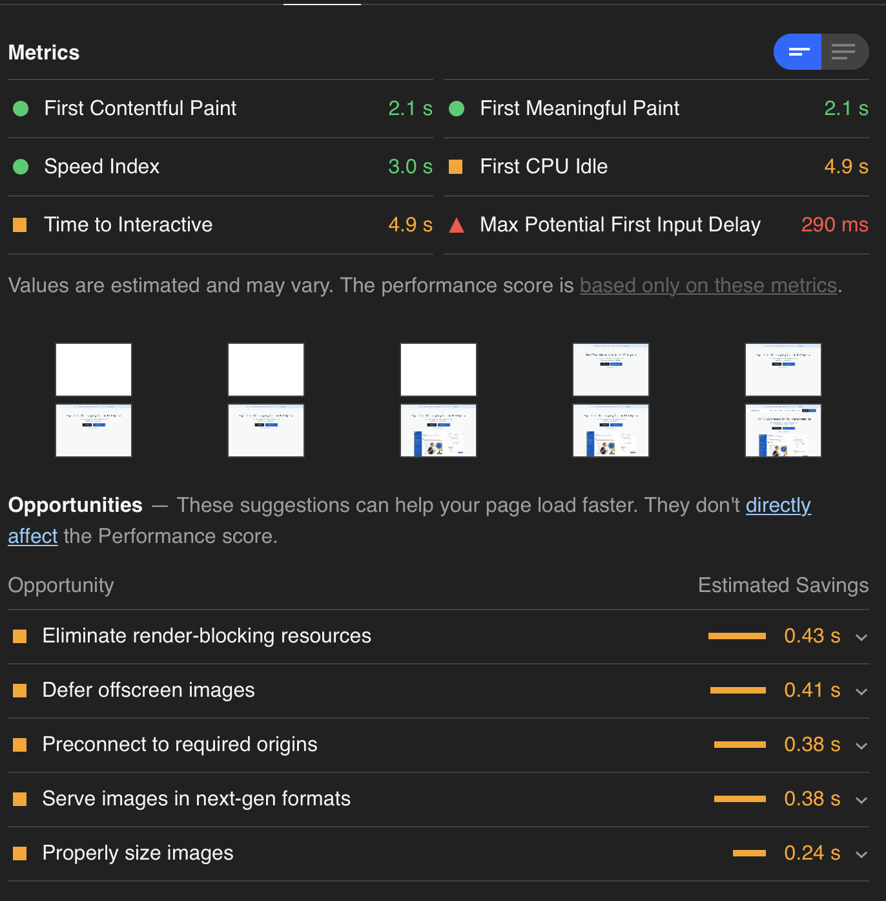
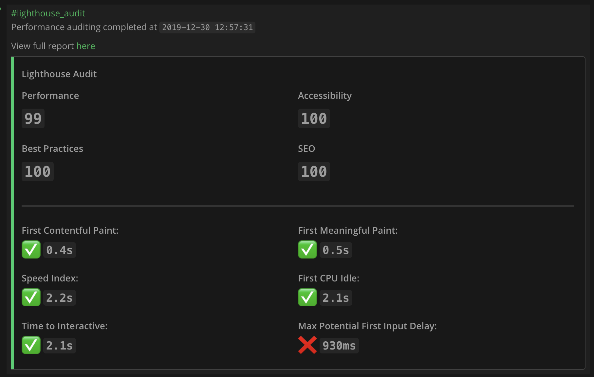
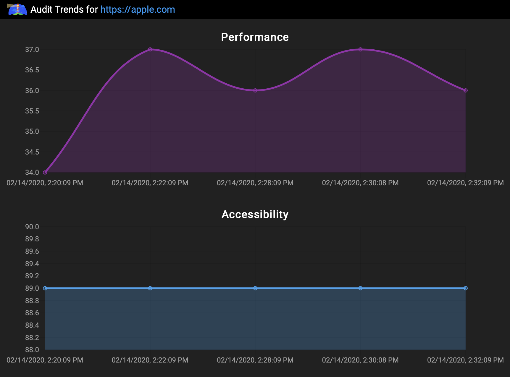

# Using ChatOps interfaces for website auditing and performance tracking over time

Developers strive to make sure the software they're writing is "optimal", but figuring out what constitutes as optimal in website development turned out to be vague and difficult to achieve. And while many recognize that better performance is something to strive for, only a few have the know-how to impact performance in a meaningful way, and even fewer understand that there are other metrics that are just as important.

This was one of the key drivers for Google to develop its Lighthouse Auditing tool. Lighthouse audits a site of your choice for a number of key metrics that relate to 5 different categories:
* Performance
* Accessibility
* Best Practices
* Search Engine Optimization
* Progressive Web App

This allows developers working on a new site to quickly test how their website performs against each metric, and Google provides a detailed report with customized tips for how to improve the metrics of _your_ particular site.

Lighthouse checks as many as 80 different metrics for all 5 categories and leaves you with a clear gameplan of how you'd be able to improve each metric.

## Limitations

One of the leading reasons why a tool as good as Lighthouse has struggled to gain significant popularity is because of how hard it is to integrate it into the regular workflow of developers. The easiest way to currently use it requires you to remember to visit the `Audit` tab of the Chrome dev tools and manually run an audit.

And the main issue with the `Audit` tab is that the performance metrics may wildly vary depending on your internet connection, or processes running in the background of your computer.

The only valid alternative that doesn't run into the first two problems is setting a CI/CD pipeline to run periodic audits against your website, but the barrier of this one lies with requiring you to have prior knowledge of setting up CI/CD pipelines, and with the fact that it is difficult to view reports and track its results over time.

## @ChatOps joined the channel

Creating a containerized chatbot server offers the same benefits as running CI/CD pipelines with regards to getting consistent audit results, with the added benefit of giving you full control of how your audits can be run.

Utilizing Mattermost's slash commands, developers can run ad-hoc audits on their websites or schedule periodic runs, and view the results directly on a Mattermost channel of their choice

On top of that, having their audit results persisted on MongoDB allows them to have complete access to their history of past audits, which are easily accessible by clicking the `View full report here` button on any in-channel reports.

And after running at least 2 audits on a given URL, developers can view trend charts of how the latest audit compares to past results on each of the 5 audit categories

You may view the original project and instructions for setup at https://github.com/avasconcelos114/lighthouse-bot