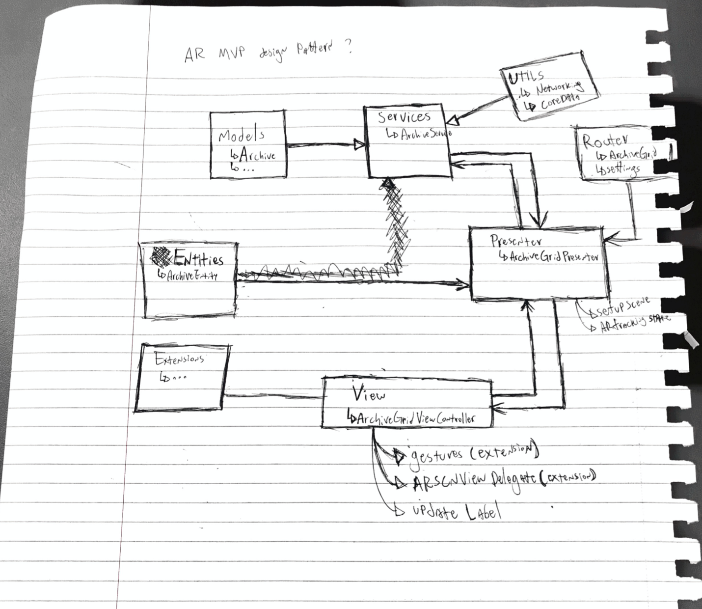

#### Introduction
There is little doubt that VR and AR are becoming some of the hottest topics in tech right now. With constant leaks and speculations of what would a more refined version of a VR/AR headset look like. While companies like Oculus, HTC, and Valve are fighting for the top spot in Virtual Reality headsets, when it comes to Augmented Reality, one of the companies whose name come out on top (despite not having released its version of AR glasses) is Apple.

The reason being that Apple has invested heavily in companies developing AR tech, and have gone as far as creating its own development kit for AR experiences and games, called ARKit, which uses the camera functionalities of your phone to find surfaces and reference points, to which you are able to attach your own 3D objects to (in a nutshell).

#### The MVC problem
While there are plenty of tutorials online that will get you covered on how to initiate your own scenes, and attach child nodes, animate them, or import your own assets to your project, there haven't been any tutorials that cover a smart way to organize your app to allow it to scale gracefully.

What this means is that by following Apple's MVC design pattern, you end up creating your whole scene and interactions onto the ViewController itself, which then leaves you with **massive** view controllers, and no easy way to refactor them into easier to manage sections.

Realizing this problem, I set out to try and implement other well-known design patterns for iOS apps, and find the one that fits best alongside ARKit applications.

#### Iteration is key
As I was (and still am) a newcomer to iOS development, the first thing I needed to do would be to list out the available design patterns, with their respective characteristics:
    
MVC: Stands for Model-View-Controller, where the Model defines the state of the application, the view represents UI components, and the controller is responsible for allowing users to interact with the application's state.
    
MVVM: Stands for Model-View-ViewModel, where the Model and View behave similarly to the MVC pattern, but the ViewModel is added to transform values from the model so that they can be used in the view.
    
VIPER: Stands for View-Interactor-Presenter-Entities-Router, which provides a divided separation of concerns where the View displays information that is received from the Presenter, the Interactor retrieves entities and processes business logic, Entities are simple data objects (similar to Models), and the Router handles app navigation.  
  
MVP: Stands for Model-View-Presenter, where the view handles the display of information and changes to the view itself, the presenter processes business logic and returns them to the view, and the Models are simple data structs.

Looking at the basic descriptions of each pattern, it was hard to figure out exactly where should I be adding interactions and behavior to my AR entities, and a few failed experiments later, I've come to the conclusion that none of the currently popular design patterns can be efficiently utilized to design a reasonable large-scale AR app. A quick overview of my findings went as below:  

* MVC: `ViewController`s become too massive too quickly.
  
* MVVM:  Does not translate well into ARKit functionality, as the `ViewModel` would require access to modify the `ARSCNView` outlet (which goes against the original pattern of having information flow FROM the `ViewModel` TO the `ViewController`)
  
* VIPER:  Most used for applications with various screens, as most of the logic in an AR app gets rendered in a single storyboard View, the VIPER design pattern is unnecessarily complex for the scope of this project.  
  
* MVP: Having to add all entity manipulation logic on top of all of the business logic makes it just as susceptible to have massive Presenter files as the MVC pattern would have massive ViewControllers

#### The Answer
The answer as I've found, is to add a separate element to design patterns that are solely responsible for controlling an individual SCNNode element, my initial sketch of how the application would function went as below (please forgive my poor handwriting)

  
This method creates a twist on the MVP pattern, which includes the addition of your scene’s Entities (to which I've come to call MVPE), where we have the following:
The `ViewController` is responsible for handling user interaction (taps, pinches, rotation and the like), and trigger events on the Presenter
The Presenter handles business logic (and in my example above, use the `Services` to make API calls), and instantiates Entities based on information received by the `ViewController` (position and rotation of entity, for example).  
  
Once an Entity is instantiated, the Presenter makes use of a protocol to request that the ViewController attaches new SCNNodes to the SCNScene. Methods defined in Entities can also be triggered by the Presenter to update the Entity (like changing the contents of SCNText, the position of a node, or to remove it entirely from the scene)

#### Conclusion
Having a whole new entity to account for in AR apps, as opposed to traditional iOS apps, means that design patterns should be adapted to handle that extra layer of complexity, and while my efforts may not present a perfect solution (As I'm still rather new to iOS development), I hope it may trigger some ideas among some of the more senior devs out there who'd like to chime in and share their views on the topic.  
  
Please feel free to offer your feedback, and experiences into it, it is my hope that we can find a more sophisticated way to develop AR content, in a more easily maintainable and efficient manner 🙂  
  
Sources:   
Viper Design Pattern: https://medium.com/slalom-engineering/clean-architecture-for-ios-development-using-the-viper-pattern-fac30f5d29fc  
MVVM Pattern: https://www.raywenderlich.com/34-design-patterns-by-tutorials-mvvm  