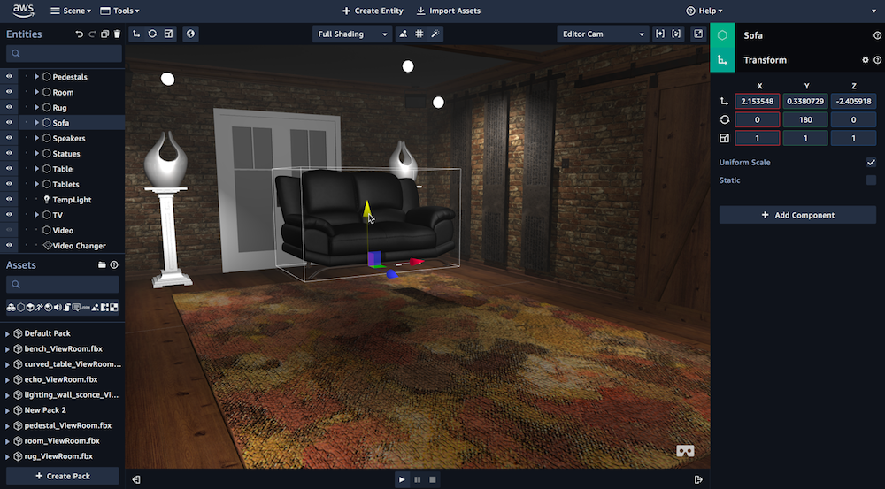

#### What is AWS Sumerian?
As we've seen the introduction of Apple's ARKit, and the somewhat recent release of Google's ARCore, we're getting to see a whole new generation of apps that incorporate Augmented Reality into its stack of features.

Amazon couldn't help but join the race by providing a different way in which to allow developers to create an AR environment. While in its present state developers have to create scenes into their respective applications (be it with ARKit, or ARCore), AWS has provided us with a separate option of publishing, and loading our scenes directly from the internet.

This means that as long as you're willing to compromise and have your AR experience be dependent on having an internet connection (which may be a fairly big barrier to some), you can develop a single AR scene that can be quickly incorporated into native ARKit _and_ ARCore applications.

In this series of articles we'll be viewing how to get started with an AR Application, then we'll look at how to add your own custom Entities to your scenes, and add a layer of interactivity to them utilizing state managements and AWS Sumerian's scripts.

#### Requirements
* An active [AWS Account](https://aws.amazon.com/)

#### Getting Started
To begin, head over to your [AWS Console](https://console.aws.amazon.com/console/home), and under the **VR & AR** section, you'll want to click on **Amazon Sumerian**. This will prompt a new tab to launch and you should be sent over to your Dashboard, now we're ready to begin!

##### 1. Creating Your Project
Now that we're ready, notice how your screen is divided into 3 main sections. To your left you have your navigation menu, where you're able to create new projects to manage them under, in the center you'll notice a big **Create New Scene** button, but let's not click on that one yet! And on the right section you have a sidebar that will throw you information about whatever you selected in the other sections

What we want to start with, is to create a new project where we'll be handling all scenes and entities in our tutorial series. We'll do that by:
1. Click on the **Projects** option on our navigation menu
2. Click on **New Project**
3. Input **Practice Sumerian Project**, or whatever your heart desires
4. Hit the **Create** button

**IMPORTANT: In order to be able to import a 3D asset into your AR Scene, they will need to be a part of the same project**

##### 2. Creating your scenes
Now that we have a project set up, we'll be wanting to create the following scenes:
* A 3D entity to render in AR
* The AR scene itself

###### 3D Entity Scene
1. Start by going back to the **Home** of your dashboard
2. Click on **Create New Scene**. AWS Sumerian will prompt you for a name, so we'll input `example_entity`
3. Hit **Create**

If everything goes as expected, we'll now be sent to the editor screen with an empty scene.

BUT WAIT, THERE'S MORE! 
  
In Sumerian's current version, you can't add a scene to a project at the moment it's created. To do that you'll have to do the following: 
1. Return to your Dashboard by clicking on the top-left **Scene** dropdown menu, and clicking on **Exit to dashboard...**.
2. Click on the scene you just created (be sure not to click on the bottom part of it, as you'll be sent directly to the editor screen)
3. On the right sidebar, look under the **Actions** section, and select the **Move** option
4. Click on the project you just created and hit **Move**

_phew!_ 
Now for the last part of setting our project up for AR!
  
###### AR Scene
We're going to create our AR scene using the following steps:
1. Go over to **Home** in your dashboard, and look down at the **Create scene from template** section in the middle. 
2. You'll notice we have an **Augmented Reality** template all ready for us. Click on that, input a name for your scene and **Create** it.
3. Just as the previous step, you can go back to the dashboard and **Move** this scene into your project

#### Wrapping up
If you've completed all the things described above you should have:
1. One practice project where you can manage all your scenes and assets in.
2. One scene where you will be creating a 3D entity
3. One AR scene where we'll import 3D assets into

You may now proceed to [the second part](https://dev.to/wandererstudio/rendering-your-first-ar-object-with-aws-sumerian-22-1jn0) of this tutorial, where we'll go over how to create 3D entities and programatically add them into AR scenes using AWS Sumerian's scripts.

#### Bonus information
* AWS Sumerian community on Slack: https://amazonsumerian.slack.com
* Official link to tutorials on AWS Sumerian: https://docs.sumerian.amazonaws.com/
* Twitch tutorials on how to work with Sumerian: https://www.twitch.tv/jsmeester/videos/all