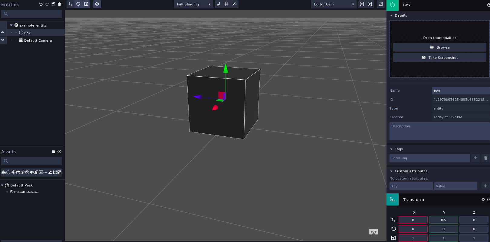
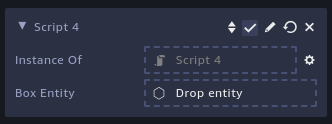

If you've followed [the previous article](/blog/rendering-your-first-ar-object-with-aws-sumerian-1) on this tutorial, you should now have a working project with two scenes attached to it.
  
We'll now go over how to create and publish scenes, and use these other scenes inside other scenes inside your projects.

#### Creating a 3D Entity
##### Adding an Entity
Now we're ready to keep going, click on the scene you want to move into and enter the editor screen

Since we just want to render a simple 3d object, this is what we're going to do:
1. Click on **Create Entity** at the top of the editor screen.
2. Select the **Box** entity on the top-left corner of the prompted screen.
3. (optional) Click on the box, and change its `name` property on the right-hand side of the screen, so that you can identify this entity more easily in the future.



As AWS Sumerian saves all changes automatically, we're pretty much done creating a basic 3D shape that would be rendered on the screen (Though you can feel free to make it as complex as you like).

##### Creating an asset pack
On the bottom left corner of the editor screen, you'll notice an **Assets** section in there with a variety of icons and a tree hierarchy menu. 

That section is where you will be able to create Asset Packs, which can then be shared between all scenes in your AWS Projects. To add our own customized pack in there, follow these steps:
1. Click on the **Create Pack** button
2. Select the newly created `New Pack`
3. Change its `name` property on the right side of the screen, as this is a name you'll be referring back to in other scenes, you want to be able to recognize your assets
4. Drag the box entity on the top-left right of the screen (in the Entities panel) inside your new Asset Pack

If everything went well, we now have a custom pack with a 3D entity inside it, now all that remains in this step is to make it accessible to other scenes.

##### Exporting asset packs
To export any Packs you create, you just have to hover your mouse over the desired pack and click on the second icon to the left.

This should prompt a modal that will ask you what kind of pack you're going to be exporting, in this case we're exporting a pack in the `Entities` category.

#### Handling your AR Scene
Now that we have a readily available 3D asset on hand, we just have to enter our AR scene and make use of it!

##### Scene elements
Going back to the editor screen of our AR Scene. You'll notice on the left side of the screen that we have the following entities:
  * AR Camera: The initial point where the scene gets rendered, with the coordinates `(0, 0, 0)` on an `(X, Y, Z)` axis.
  * AR Anchor: An anchor is a coordinate you can use to attach entities to your scene, the AR Template comes with an anchor automatically placed at the `(0, 0, 0)` coordinate.

##### Importing assets
The first step we'll want to take is to import our asset pack to the scene.

Just click on **Import Assets** at the top, select the pack you want (notice that there are many pre-made options in there to play with as well!), and hit **Add** at the bottom of the menu. This should add a new pack on your `Assets` menu.

##### Adding a script
At this point we _could_ just drag our 3D asset into the scene and render it in an app. 

But I found that most real apps are more interested in programatically adding objects to their scenes instead of "hard coding" them in there. To accomplish this we'll be having to use AWS Sumerian's scripting functionality, which will require you to know a bit of Javascript.

First thing we want to do is adding a script to the `ARAnchor` entity:
1. Select the `ARAnchor` entity on the top-left tree hierarchy menu
2. Scroll down the properties pane on the right side of the screen, to find the `Scripts` section
3. Click the `+` button to add a new script, and select the `Custom` option

This will create a script template that contains a few life-cycle functions that are triggered at various times. 

Over this example we'll only be working with the `setup` function, and adding our custom `parameters` at the bottom of the file.

##### Instantiating an object
We'll need to load our custom-made 3D asset into this script so that it can be rendered, for that we'll need to add a `parameter` for our function that can receive said asset:

```js
var parameters = [
	{type: 'entity', key: 'exampleEntity', description: 'Example Entity'},
];
```
Note: You may call the `key` and `description` values whatever you wish, however it's recommended to keep it a value relevant to the asset pack you'll load into this parameter.

At this point you may save your script file, and you'll notice that a new slot with the `Entity` attribute appeared on the right-hand attribute menu (inside the Script section). 



At this point, you can drag your asset pack into the empty slot and the name of your pack should now be seen inside that empty slot, and to finalize the process, add the bit of code that will instantiate your asset and place it inside the AR world scene:
```js
function setup(args, ctx) {
	const arSystem = ctx.world.getSystem('ArSystem');

	// Creates an Entity and adds it to the world
	var x = 0;
	var y = 0;
	var z = -1.5;
    var translation = new sumerian.Matrix4(
		1, 0, 0, 0,
		0, 1, 0, 0,
		0, 0, 1, 0,
		x, y, z, 1,
	);

	var clonedEntity = sumerian.EntityUtils.clone(ctx.world, args.exampleEntity);
	clonedEntity.addToWorld();
	clonedEntity.setComponent(new sumerian.ArAnchorComponent());
	arSystem.registerAnchor(translation, function(anchorId) {
		clonedEntity.getComponent('ArAnchorComponent').anchorId = anchorId;
	})
}
```
To explain the code seen above:
Firstly we instantiate `ArSystem`, a built-in functionality in Sumerian that allows the user to perform some functionality native to AR. View documentation [here](https://content.sumerian.amazonaws.com/engine/latest/docs/ArSystem.html). 

After that we set the `x`, `y`, and `z` values that we want our 3D entity to be rendered at, and create a transform value from them to be used later.

We then use the [EntityUtils](https://content.sumerian.amazonaws.com/engine/latest/docs/EntityUtils.html) to generate a clone of our `exampleEntity`, which we can receive from the `args` parameter, and add it to the World. 

As AR functions around tying Anchors to virtual objects, we now need to take the extra steps of attaching an Anchor component to our `clonedEntity`, and then register a new anchor from the `tranlation` values we set earlier.

Lastly we set the `anchorId` value of our `clonedEntity` to match the one we've just created, which will result in your object to be viewed at the position set on your `translation` value.

#### Loading the scene in an iOS App
Now that we've set up all the logic behind instantiating nodes and anchors, as well as rendering a 3D entity in real-space. We now have to test that with a real device. 

The first thing you want to do is **Publish your scene** using the top menu of the editor screen, or hitting `Shift + Ctrl + P`. Then you may follow these steps to 
run it on your device:

##### Running on iOS
1. Clone the [SumerianARKitStarter](https://github.com/aws-samples/amazon-sumerian-arkit-starter-app) repository.
2. Open XCode, choose Open on the File menu, and then navigate to the SumerianArKitStarter.xcodeproj file in the top-level directory of the cloned repository.
3. Set up your code-signing identity and provisioning profile on the General tab of the application settings. See [Apple’s documentation](https://developer.apple.com/library/content/documentation/IDEs/Conceptual/AppDistributionGuide/MaintainingProfiles/MaintainingProfiles.html) if you’re not familiar with these concepts.
4. In XCode, open the `ViewController.swift` file. Change the `sceneURL` variable to point to the URL of **your published scene** from the previous step. Append `/?arMode=true` to the URL. This parameter causes the scene to render in a way that’s more amenable to an AR experience (specifically, it enables the alpha channel on the WebGL canvas and removes the UI elements).
5. Connect your iOS device. Build and run the application.

##### Running on Android:
1. Clone the [SumerianARCoreStarter](https://github.com/aws-samples/amazon-sumerian-arcore-starter-app) repository.
2. Open Android Studio, choose Open an existing Android Studio project from the menu, and then navigate to the SumerianARCoreStarter directory in the top-level directory of the cloned repository.
3. In Android Studio, open the `MainActivity.java` file. Change the `SCENE_URL` variable to point to the URL of your published scene from the previous step. Append `/?arMode=true` to the URL. This parameter causes the scene to render in a way that’s more amenable to an AR experience (specifically, it enables the alpha channel on the WebGL canvas and removes the UI elements).
4. Connect your Android device. Build and run the app.


#### Wrapping up
Hopefully by following all of these, you've now been able to set yourself up with an AWS Sumerian project and you've grasped the basics of how to import your own elements of a scene, and make them appear on your screen on both iOS and Android devices.

While still in its infancy, the possibilities of hosting AR scenes on the web and having it be adaptable for all types of mobile devices is very exciting for me, and although this was a very shallow view of what you can do with AWS Sumerian, I invite you all to join the [AWS Sumerian Slack page](https://amazonsumerian.slack.com) and become a part of this exciting initiative.

My apologies if the writing of this tutorial was too messy, I'm not yet very experienced with writing articles like this, but I hope that I can improve with practice :)

References:
* [Running AWS Sumerian with ARCore Tutorial](https://docs.sumerian.amazonaws.com/tutorials/create/intermediate/augmented-reality-using-sumerian-arcore/)
* [Running AWS Sumerian with ARKit Tutorial](https://docs.sumerian.amazonaws.com/tutorials/create/intermediate/augmented-reality-using-sumerian-arkit/)
* [Scripting API](https://content.sumerian.amazonaws.com/engine/latest/docs/index.html)