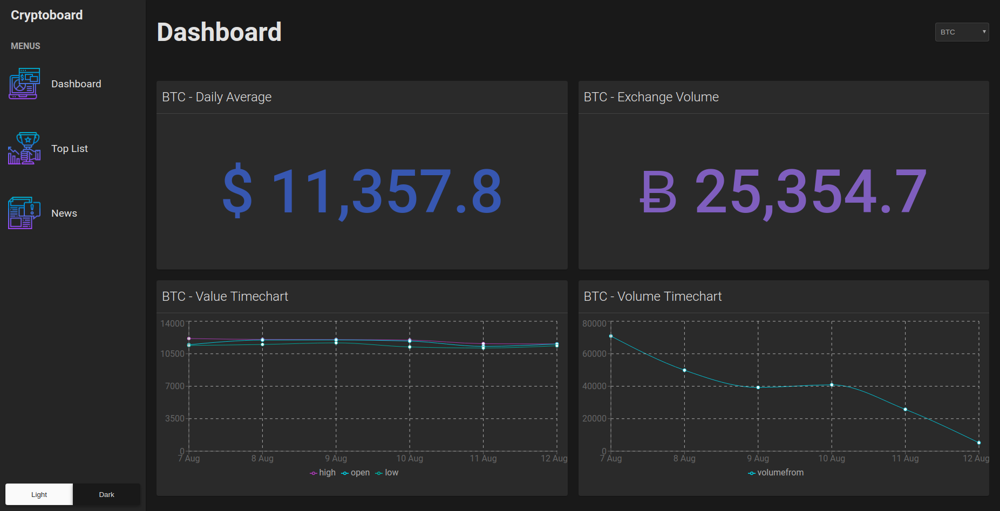

# Project recap: Cryptoboard

## Project Description  
I created this specific project with the intent to use it as a skill show-casing of various front-end technologies. Given the nature of my work in the enterprise space, many of the projects I have worked on are private and cannot have its source code shared on GitHub, and don't have a publicly accessible demo site.

This demo can be accessed at [https://avasconcelos114.github.io/cryptoboard/](https://avasconcelos114.github.io/cryptoboard/#/)

## Project Goals
Using a standard cryptocurrency API to create an interface that provides a quick look into statistics from top traded currencies, a top-50 list, and display the latest news regarding cryptocurrencies, all in a single responsive dashboard view.

## Skills showcase
* React + Typescript
* Redux
* Styled Components
* Responsive Design
* Jest & Enzyme Unit Testing
