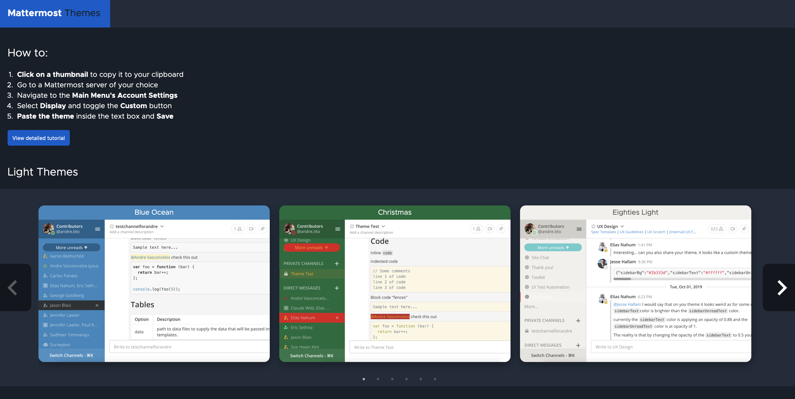
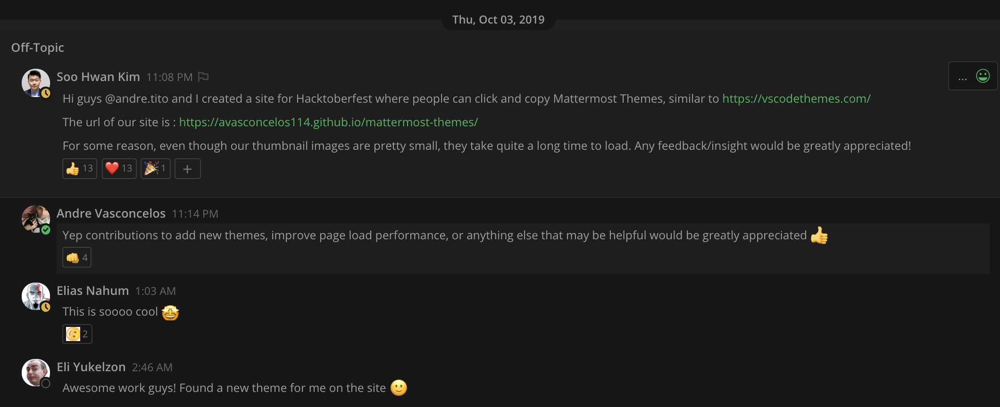
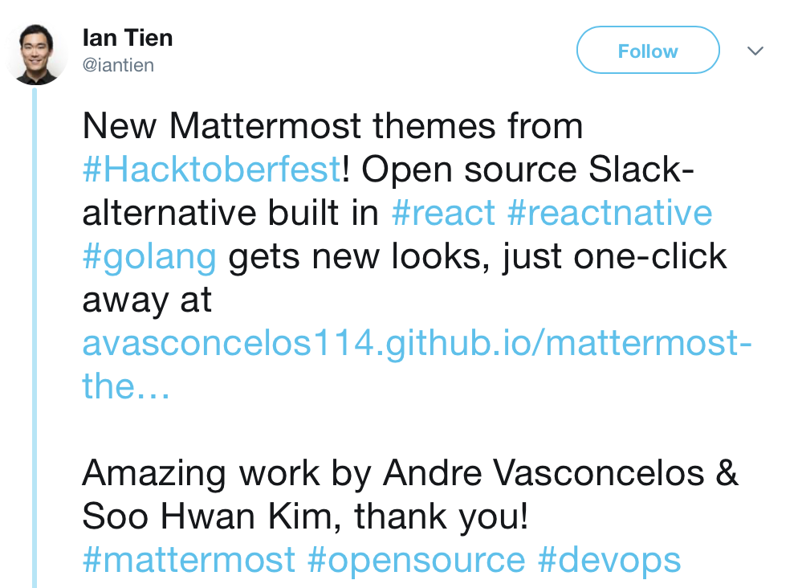
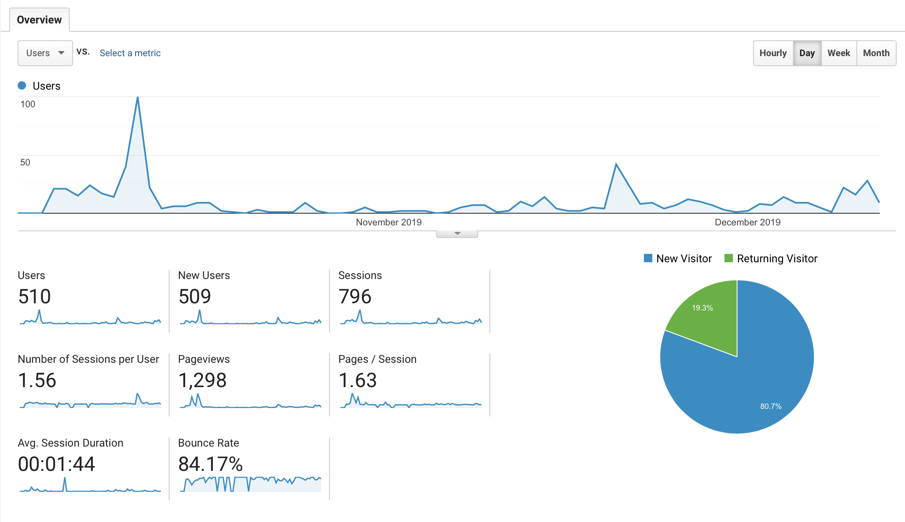

# Project recap: Mattermost Themes

## Project Description  
While searching for a good project to work on for this year's Hacktoberfest event, I happened to walk by a co-worker's desk who had been using a custom theme on his Mattermost instance. I thought his theme looked pretty cool, but I quickly came to realize that there was no easy way for two users to share themes, nor a central place where I could "shop" for new ones for myself either.

This is how I decided to make my own unique contribution to the Mattermost ecosystem, by filling a void that had long been neglected in making full use of Mattermost's customizeable theme interfaces.

For this relatively simple project, I decided to make an attempt to explore as many topics I had been unfamiliar with as possible. So I invited a fellow developer ([@josephk96](https://github.com/josephk96)) to help contribute to this project. I also made sure to employ the usage of functional components in React for the project, and in the event that a component was to be stateful, to make use of React hooks instead of utilizing class-based components with lifecycle methods and constructors.   
   
I made sure to set a rule for the repository where a PR can't be merged without at least 1 reviewer's approval, to force both myself and my fellow developer to get used to going through PR review workflows (as we work at a firm that only maintains software, there isn't much to "review" here).   
  
Once the project began to look presentable, I deployed it to GitHub Pages, and set up GitHub Actions that would automatically build and deploy the project to GH Pages whenever the `master` branch was merged (i.e. a PR was accepted).

Once the project was announced on the official Mattermost community server, the project was very well received by the Mattermost team, where they immediately showed us their appreciation and started showing off which themes they had picked for their workspace

The project even got a shout-out from Mattermost's CEO 😱

 

As of yet, the project counts with over 30 themes that users are able to select with the single click of a button, and apply it to a Mattermost instance of their choice. And the project has been visited by over 500 users from 48 different countries! 

 

## Project Goals
* Provide a place where Mattermost users can switch through various themes with relative ease
* Practice basic UI/UX design utilizing Affinity Designer (single-purchase alternative for Adobe Illustrator)
* Utilize React hooks and functional components
* Get better acquainted with PR reviews on GitHub
* Explore GitHub Actions functionalities

## Skills showcase
* React.js
* Styled-components
* GitHub Actions

## Conclusion

While I'm very excited and happy about what this project has achieved, and how it's far surpassed my expectations for how often it'd be used by the community. 

However, I still see much room for improvement in the areas of:
- Having an easy-to-remember URL available
- Having a back-end that enables anyone to upload their themes onto the site, and receive credit for having uploaded that theme
- Basic stats on how many people copied a theme
- A possible "like" feature for themes
- A separate page for light/dark themes to allow users to quickly look through all available themes without using the front page's carousel component

That will likely require more time (and money!) to host a server, buy a domain name, and develop a backend on Node.js on a Redis or MongoDB data store that would handle all of the theming logic. While a bit challenging I'd definitely like to make an attempt to build this in the future.