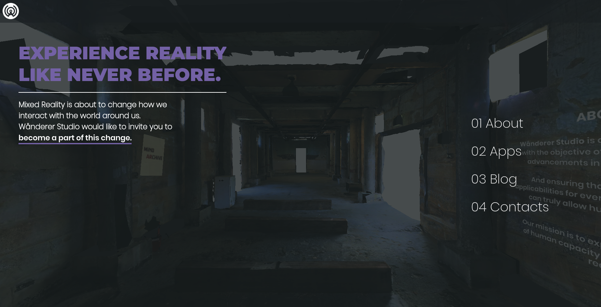
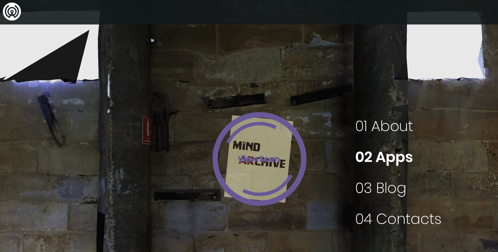
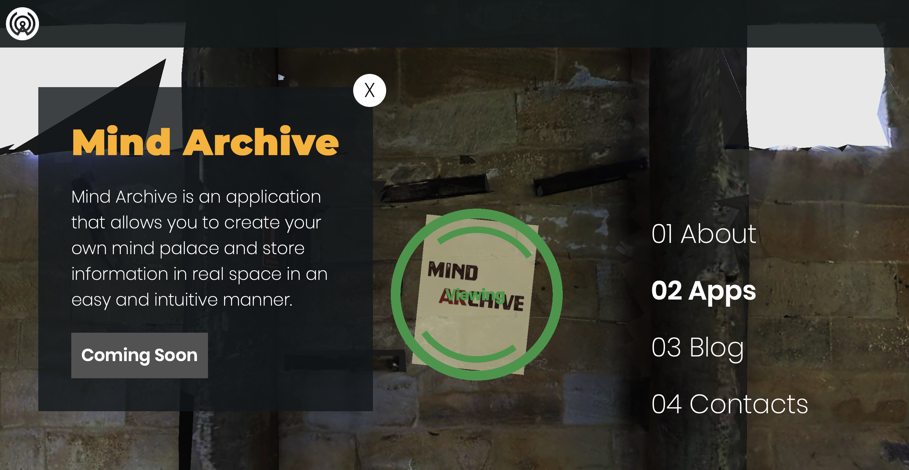

# Project recap: Wånderer Studio - Website

## Project Description  
In my efforts to create a personal brand that seeks to explore some of the currently available tools to develop AR and VR applications, I decided to build a website that reflects these goals in the same spirit. As such I decided to create a VR-like experience using Three.js, that would simulate walking through a corridor in 3D space to interact with objects, and visualize different forms of information.

I tried to steer away from React or Vue, and keep the application relatively "pure" by utilizing Javascript ES6 syntax. But while I still needed some DOM manipulation to happen, I decided to employ a very light-weight library (only 2KB!) called re-DOM that handles DOM manipulation and creates a few basic lifecycle methods (in a similar fashion to React or Vue).

Searching through a few websites I managed to find a good 3D model that was free to use (not very well optimized for the web at first, but a lot of tinkering with the model on Blender solved that issue), and I managed to integrate that on my 3D scene.

In the end I managed to use a mixture of interactive 3D objects and overlayed DOM elements to present information in a way that felt reasonably natural.

__A "scanning" animation triggers when hovering an object__

__Clicking the object triggers a modal to be rendered on screen__

## Project Goals
* Create a website that provides a VR-like experience from the browser
* Learn more about Three.js library

## Skills showcase
* Javascript (ES6)
* Redom
* Three.js

## Conclusion
Three.js proved to be a hard beast to tame!

For someone who'd only recently started dealing with AR/VR related concepts, having to create scenes, cameras, deal with animation loops, and load every individual asset (fonts, images, obj/mtl files) proved to be quite challenging, but I'm satisfied with how the website looks and feels like.

I'd like to see whether I could migrate from Three.js to using Aframe, so I could avoid a couple of oddities that happen when connecting to the site using a mobile device (the camera positions don't always work the best).

You can find a link to the live website here: https://wanderer.studio
